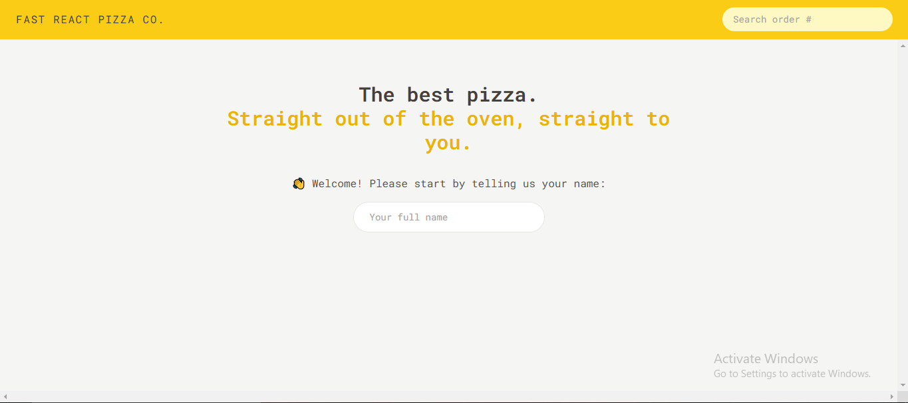
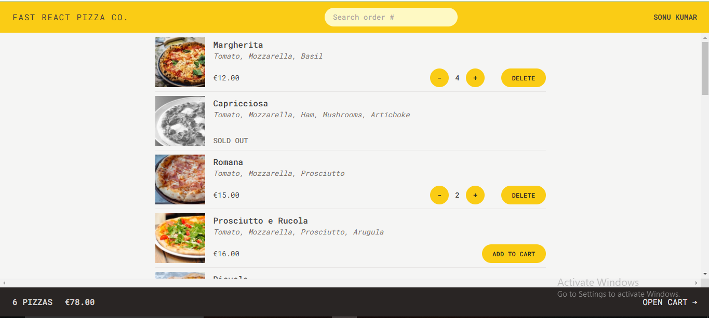
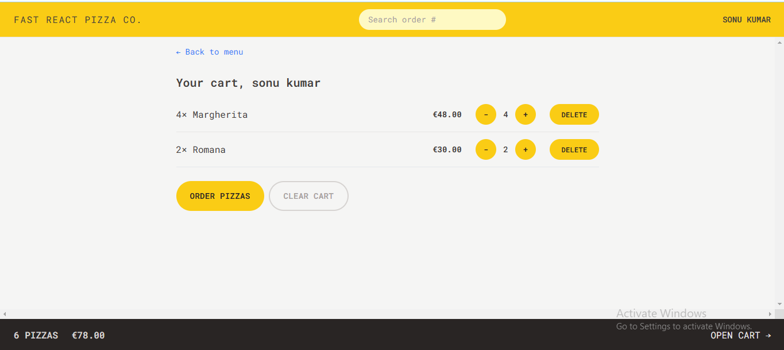
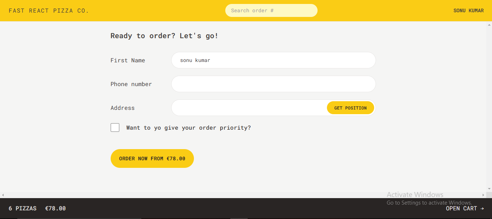
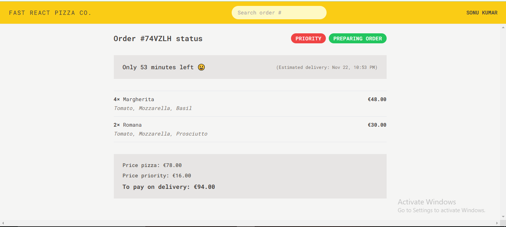

# Pizza Order App

Welcome to the Pizza Order App! This is a simple React application that allows users to place pizza orders by selecting from a list of available pizzas

## Features

- User can enter their name.
- Displays a list of available pizzas with prices.
- Users can select a pizza and specify the quantity.
- Option to increase or decrease the quantity of selected pizzas.
- Place an order with the selected pizzas and quantities.

## Technologies Used

- **React**: JavaScript library for building user interfaces.
- **React-Redux**: For managing application state..
- **Tailwind**: For styling the application.
- **JavaScript**: For handling the application logic.

## 📷 Screenshots

